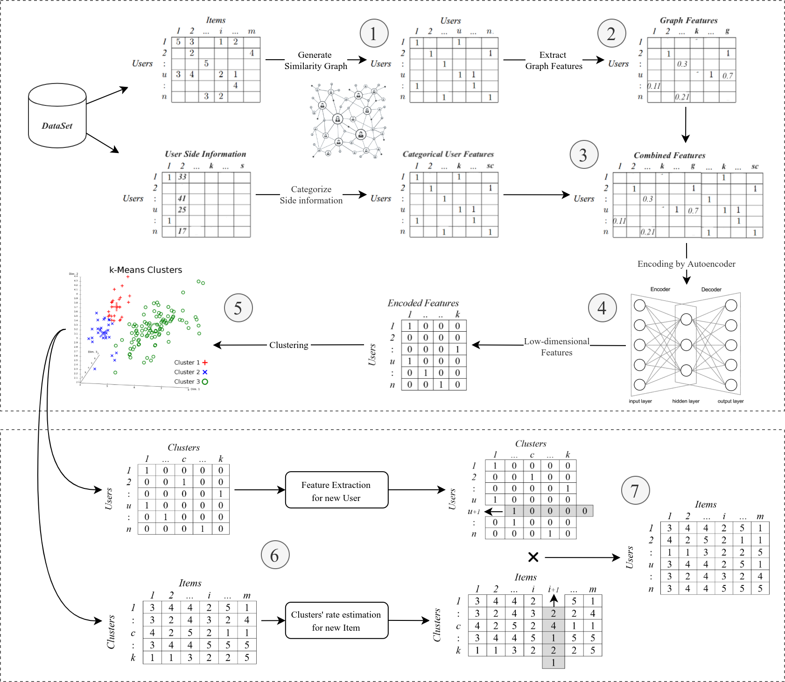

<h1 align="center" id="title">Graph-based Hybrid Movie Recommender System</h1>

<p id="description">The machine learning part of a graduation project for students of the Faculty of Engineering Alexandria University.</p>

<p align="center">
  
  
  
  
</p>

## 📝 Table of Contents

-   [About](#about)
- [File Hierarchy](#file_hierarchy)
-  [Getting Started](#getting_started)
- [Built Using](#built_using)
- [Authors](#authors)
- [Built with](#built_with)
- [Acknowledgments](#acknowledgments)

## 🧐 About <a name = "about"></a>

This project is the machine learning part of a graduation project for students of the Faculty of Engineering Alexandria University. The project is a hybrid movie recommender system that uses a graph-based approach to recommend movies to users based on their ratings and the ratings of other users. The project is divided into two parts: the machine learning part and the web application part. This repository contains the machine learning part of the project.

The structure:



## 📁 File Hierarchy <a name = "file_hierarchy"></a>

The project contains the following hierarchy:

``` 
├───datasets
│   ├───combined-u          # The combined dataset of users similarity graph and users' side information
│   └───ml-1m               # The MovieLens 1m dataset
│   └───seen                # The dataset of ratings and side information of 5940 users (for the model)
│   └───unseen              # The dataset of ratings and side information of 100 users (for the web applicationdatabase)
├───images                  # The images used in the documentation
└───models                  # The trained models of the encoder and Kmeans clustering
``` 

## 🏁 Getting Started <a name = "getting_started"></a>

These instructions will get you a copy of the project up and running on your local machine for development purposes.

### Prerequisites

The project requires Python 3.10.0. You can download the latest version of Python from [here](https://www.python.org/downloads/).
The project also requires the following packages:

*   TensorFlow 2.10.0
* Jupiter 1.0.0
*  Keras 1.2.1
* scikit-learn 1.1.2
* pandas 1.3.3
* numpy 1.21.2
* matplotlib 3.4.3

You can install all the required packages by running the following command:

```
pip install -r requirements.txt
```

### Installing

To get a local copy up and running follow these simple steps.

1. Clone the repo

```
git clone
```

2. Install the required packages

```
pip install -r requirements.txt
```

## ⛏️ Built Using <a name = "built_using"></a>

-   [Python](https://www.python.org/) - Programming Language
- [jupyter](https://jupyter.org/) - Interactive Development Environment
-  [pandas](https://pandas.pydata.org/) - Data Analysis Library
-   [TensorFlow](https://www.tensorflow.org/) - Machine Learning Framework
-   [Keras](https://keras.io/) - Deep Learning Framework
-   [scikit-learn](https://scikit-learn.org/stable/) - Machine Learning Library

## ✍️ Authors <a name = "authors"></a>

-   [@tarek0m](https://github.com/tarek0m) - Initial work and documentation

## 🎉 Acknowledgements <a name = "acknowledgement"></a>

-   [GHRS: Graph-based Hybrid Recommendation System with Application to Movie Recommendation](https://arxiv.org/abs/2111.11293)
-   [MovieLens 1m Dataset](https://grouplens.org/datasets/movielens/1m/)